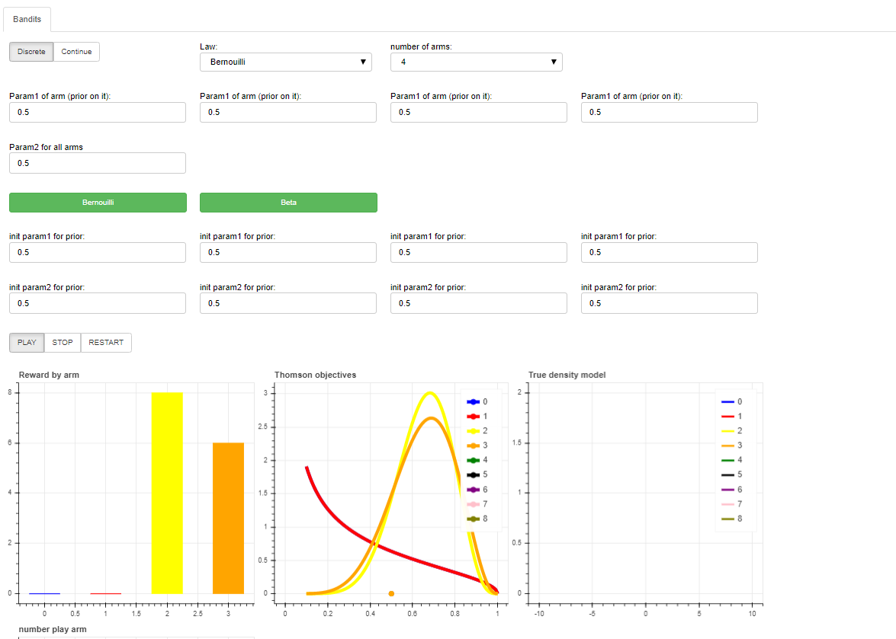
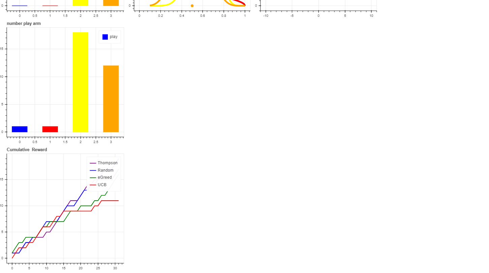

# Requirement
- Python 3.6
- Bokeh 

To install bokeh : pip install bokeh 

# Run the project

To launch the app, you just have to extract the folder and run "bokeh serve --show app2/" from "bandit-visu" folder.

# Demo of the app

You can choose : 
 - the number of arms
 - the type of distribution (continue or discrete, severals laws are implemented)
 - severals visual metrics are available 
 

 
 
 
 
#### Note : This is a common project with Rapahel Cousin (git := racousin). 
